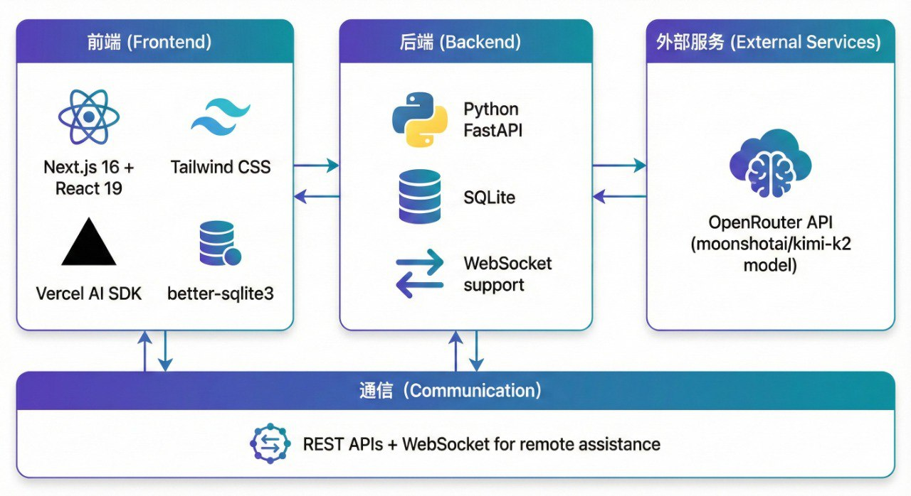

# Whipnae

Whipnae is a bilingual finance companion with a Next.js frontend and a FastAPI backend. This README focuses on getting your local environment running quickly.

## Repository layout
```
whipnae/
├── backend/   # FastAPI app + SQLite helpers
├── frontend/  # Next.js 16 App Router UI
├── package.json
└── README.md
```

## Requirements
- Node.js 20 (or newer) with `npm`
- Python 3.11+
- OpenRouter API key for conversational + profile AI features (optional but recommended)

## Tech stack
- Frontend: Next.js 16 (App Router), React 19, TypeScript, Tailwind CSS v4
- Backend: FastAPI, Uvicorn, Pydantic v2, SQLite
- AI: OpenRouter API (optional backend Gemini stub)



The diagram above shows how the Next.js frontend, FastAPI backend, and OpenRouter services communicate over REST and WebSocket channels.

## Environment variables
Create the files below before starting the servers.

### `frontend/.env.local`
```
OPENROUTER_API_KEY=sk-...
NEXT_PUBLIC_API_BASE_URL=http://localhost:8000
NEXT_PUBLIC_WS_URL=ws://localhost:8000
```

### `backend/.env` (optional)
```
GEMINI_API_KEY=your-key-if-used
```

## Backend setup
```bash
cd backend
python3 -m venv venv
source venv/bin/activate  # Windows: venv\Scripts\activate
pip install -r requirements.txt
uvicorn main:app --reload --host 0.0.0.0 --port 8000
```
- The server seeds `frontend/src/lib/db/transactions.db` on first run.
- REST endpoints live under `http://localhost:8000`, WebSocket remote assist runs on `ws://localhost:8000/ws/remote/{user_id}`.

## Frontend setup
```bash
cd frontend
npm install
npm run dev
```
- App is available at `http://localhost:3000`.
- Run `npm run lint` before committing UI changes.

## Running both services
Use two terminals from the project root:

```bash
# Terminal 1
cd backend
source venv/bin/activate
uvicorn main:app --reload

# Terminal 2
cd frontend
npm run dev
```

## Useful scripts
- Frontend build: `npm run build`
- Frontend lint: `npm run lint`
- Backend hot reload: `uvicorn main:app --reload`

## Troubleshooting
- Delete `frontend/src/lib/db/transactions.db` if you need a fresh seed; it will regenerate on the next backend start.
- Check that `OPENROUTER_API_KEY` is set if chat or profile insights return 401 errors.
- Ensure both servers are running before using remote assistance or AI features.

## 中文说明

### 项目简介
Whipnae 是一个双语金融助手，前端使用 Next.js，后端使用 FastAPI。本说明主要帮助你快速在本地运行前后端服务。

### 技术栈
- 前端：Next.js 16（App Router）、React 19、TypeScript、Tailwind CSS v4
- 后端：FastAPI、Uvicorn、Pydantic v2、SQLite
- AI：OpenRouter API（可选的后端 Gemini 封装）


上图展示了前端、后端与 OpenRouter 服务之间通过 REST 与 WebSocket 通道协作的方式。

### 前置条件
- 安装 Node.js 20 及以上版本（包含 `npm`）
- 安装 Python 3.11 及以上版本
- 获取 OpenRouter API Key（用于会话和画像功能，可选但推荐）

### 环境变量
在项目根目录创建：

`frontend/.env.local`
```
OPENROUTER_API_KEY=sk-...
NEXT_PUBLIC_API_BASE_URL=http://localhost:8000
NEXT_PUBLIC_WS_URL=ws://localhost:8000
```

`backend/.env`（如需启用 Gemini）
```
GEMINI_API_KEY=你的Key
```

### 启动后端
```bash
cd backend
python3 -m venv venv
source venv/bin/activate  # Windows: venv\Scripts\activate
pip install -r requirements.txt
uvicorn main:app --reload --host 0.0.0.0 --port 8000
```
首次启动会自动生成 `frontend/src/lib/db/transactions.db` 数据库。REST 接口默认在 `http://localhost:8000`，远程协助 WebSocket 位于 `ws://localhost:8000/ws/remote/{user_id}`。

### 启动前端
```bash
cd frontend
npm install
npm run dev
```
前端默认访问地址为 `http://localhost:3000`。提交代码前可运行 `npm run lint`。

### 同时运行前后端
打开两个终端：

```bash
# 终端 1（后端）
cd backend
source venv/bin/activate
uvicorn main:app --reload

# 终端 2（前端）
cd frontend
npm run dev
```

### 常见问题
- 如需重置示例数据，删除 `frontend/src/lib/db/transactions.db` 后重新启动后端。
- 如果聊天或画像接口返回 401，请检查 `OPENROUTER_API_KEY` 是否已配置。
- 使用远程协助或 AI 功能前，请确认前后端服务均已运行。
